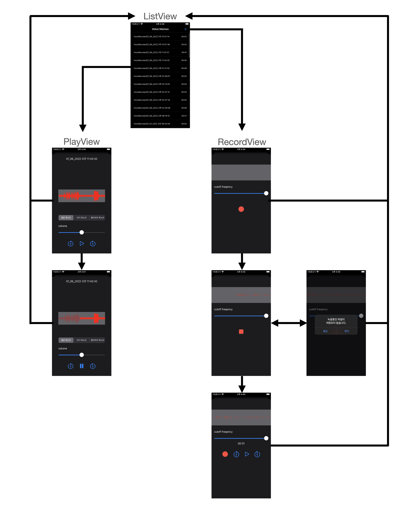
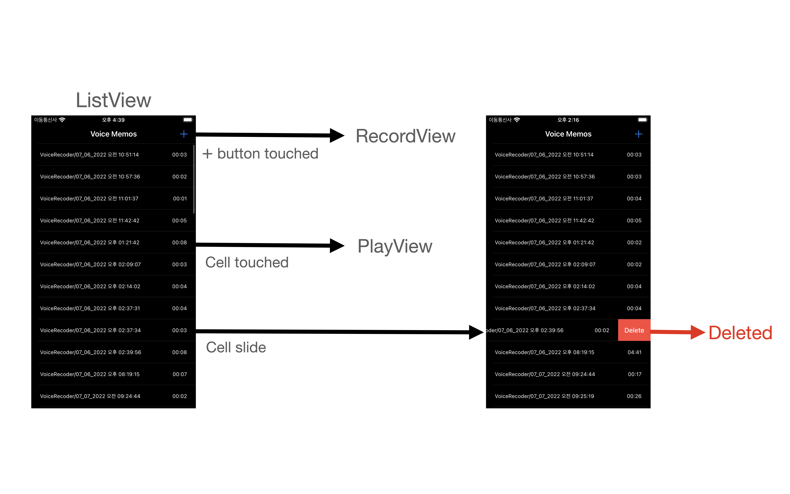
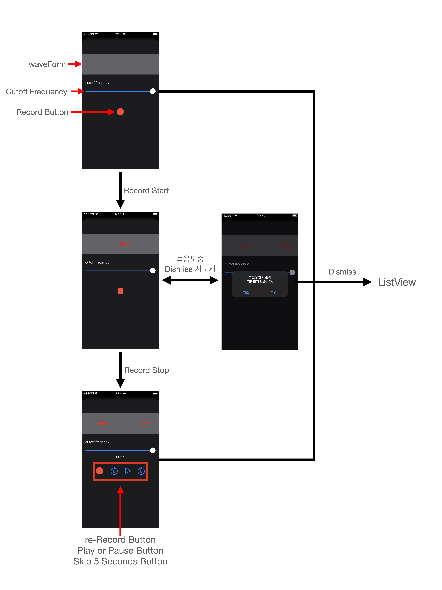
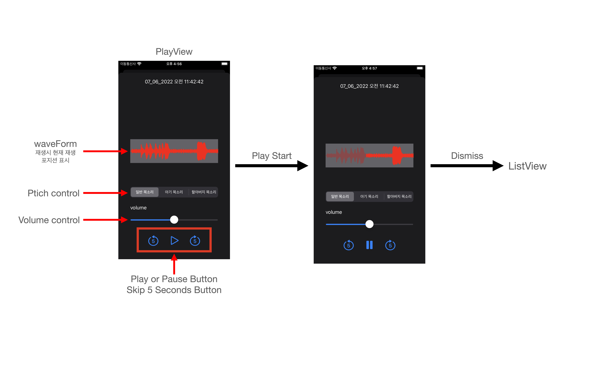
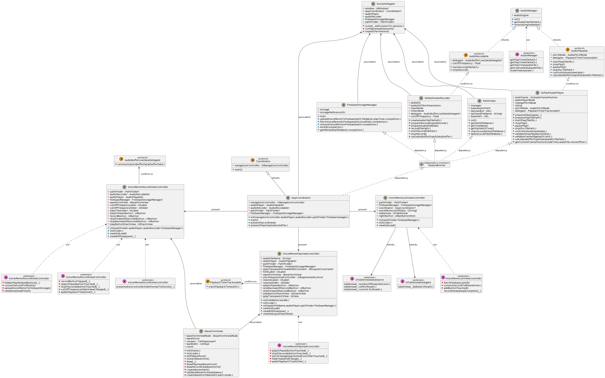

# 목차
  1. [Team](#Team)
     1. [팀원 소개](#팀원-소개)
     2. [기여한 부분](#기여한-부분)
  2. [프로젝트 소개](#프로젝트-소개)
     1. [목표](#목표)
     2. [사용한 기술](#사용한-기술)
     3. [기능 소개](#기능-소개)
        - [App Flow](#App-Flow)
        - [Demo gif](#Demo-gif)
     4. [사용한 Pattern 소개](#사용한-Pattern-소개)
        - [Coordinator Pattern](#Coordinator-Pattern)
        - [Observer Pattern](#Observer-Pattern)
     5. [Project UML](#Project-UML)
  3. [고민한 부분](#고민한-부분)
  4. [회고](회고)
  
---

# Team
## 팀원 소개 
 - 이미지, 닉네임, 담당한 기술
## 기여한 부분

# 프로젝트 소개
## 목표
> 요구사항에 적합한 녹음 앱 개발
> 외부 라이브러리 : FirebaseStorage Only!
## 사용한 기술
`Coordinator Pattern` `Observer Pattern` `Delegate Pattern`
`Code-based UI` `MVC` `Dependency inversion`
  
## 기능 소개

### App Flow
  - all Flow
  

  
  

  - ListView Flow
  

  
  

  - RecordView Flow
  

    
  

  - PlayView Flow
    

  

  
### Demo Gif
  - 첫 화면
  

  - RecordView, 레코드 기능
  
  

  - RecordView, 재생 기능
  
  

  - PlayView, 재생기능
  

## 사용한 Pattern 소개
### Coordinator Pattern
### Observer Pattern

## Project UML

  

# 고민한 부분

## Downey
## Oyat
## JMin

# 회고

## Downey
## Oyat
## JMin
