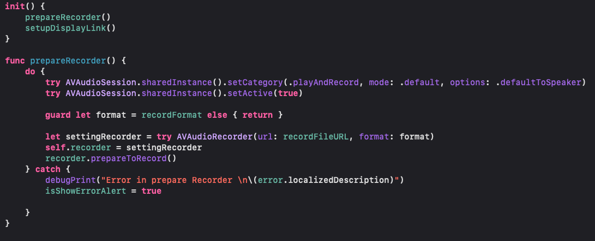
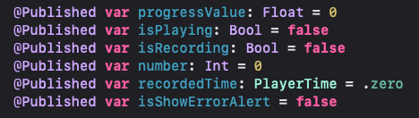
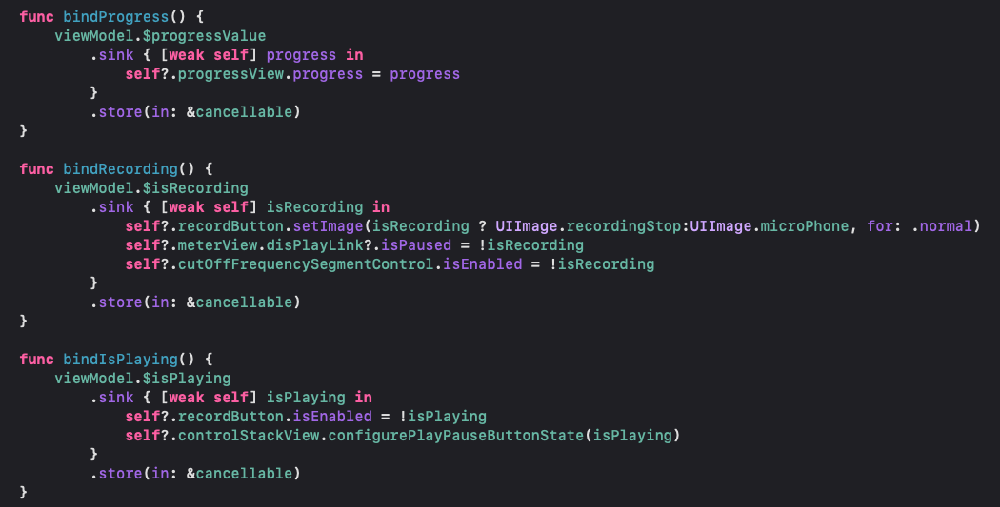
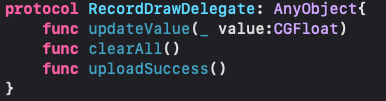

# iOS-VoiceRecorder
원티드 프리온보딩 iOS 1기 첫 번째 과제
Firebase Storage를 활용해 녹음 파일을 관리할 수 있는 녹음기 앱

# 팀원
|미니(이경민)|숭어(한승래)|
|--|--|
|||

# 개발환경
 

# 기능
|화면1|화면2|화면3|
|--|--|--|
||||

# 다이어그램
|||
|--|--|

# 구조

# 진행 과정

## 화면 1
- 미니
  - Firebase 생성 및 Firestorage 설정
  - 파일명 "현재위치_생성된 시간" 표시
  - 스와이프 동작을 통해 파일 삭제
- 숭어
  - FireStorage 파일 테이블 뷰 표시
  - 화면 2 & 화면 3 전환
  - 녹음 리스트 업데이트

## 화면 2
- 미니
  - 녹음 진행시 파형 그리기
  - 녹음 진행 및 녹음된 시간 표시
  - 녹음 종료시 해당 파일 재생
  - 녹음 종료시, FireStorage 업로드
  - 5초 전, 5초 후의 상태로 이동

## 화면 3
- 숭어

# 회고
## 미니
// 2. Combine 사용에 대한 고민 Observable 클래스에서 Combine으로 변경 하여 사용
// 3. AVAudioEngine vs AVAudioRecorder cut off frequency
1. AVAudioEngine vs AVAudioRecorder
 
처음 Recorder를 생성할 당시, 파형을 그리기 위해서는 AVAudioEngine을 활용하여 녹음 기능을 구현하였다. 하지만, Engine을 구성하는 부분에서 throw init과 Engine 구성에서의 throw 구문으로 인해서 사용자에게 좋지 못한 상황이 발생할 수 있다고 생각을 하였다. 사용자에게 확실하게 기능이 작동할 수 있는 Recorder를 사용하였다. 
  

  
하지만, Recorder를 사용하여서 Cut off Frequency를 활용하는 방법에 대해서 고민하지 않고, Recorder를 활용한 문제가 발생하였다. 주파수를 차단하는 기능을 구현하기 위해서는 AVAudioEngine에서 AVAudioUnitEQ를 사용했어야 한다. 이를 해결하기 위해서 주파수를 차단하는 방법에 대한 도메인 지식을 다양한 방면에서 검색을 해보았다. 완벽한 방법으로 주파수를 차단하는 것은 아니지만, Sample Rate를 줄이는 것으로 주파수를 차단하였다.
  
위와 같이 다양하게 고민을 하는 과정에서 많은 것을 얻었다. 기능 정의서의 나온것에 대한 정리를 먼저 하지 못한 잘못을 깨달았다. 한 화면에 들어가는 기능을 정리하고 이에 따른 프레임 워크나 라이브러리를 정하는 과정이 우선적으로 필요하다고 느꼈다. 추후, AVAudioEngine을 사용하여 EQ를 조절하여서 RecordViewModel을 업데이트 해보는 것이다.

2. Combine 사용에 대한 고민 Observable 클래스에서 Combine으로 변경 하여 사용
 
Recorder와 Player에서 제어를 하는 함수는 ViewModel에 존재하였고, 이에 대한 버튼은 ViewController에 존재하였다. 이에 대한 상태를 변경하는 과정에서 많은 메소드들이 필요하였고, 이에 대한 메소드 분리를 하는 방법이 생각나지 않았다. 이로 인해서 Observable을 생성하여 사용을 하려고 하였다. 하지만, Combine을 사용하는 방법도 있었다. 이로 인해서 숭어와 함께 고민을 하였다.
  

  
숭어와 함께 고민을 하는 과정에서 Observable을 구성하는 것에도 문제가 있었으며, Combine의 Published를 사용하게 되면, 변수의 선언만을 통해서도 상태에 대한 관리가 가능한 부분을 장점으로 생각하고, Combine을 채택하였다.
  

  
위와 같이 Published 변수들에 대한 바인딩을 수행하였다. 위와 같은 방법은 ViewModel의 변수에 대한 상태를 감지 하는 것이지만, 각 Button들에 대한 상태를 관찰할 수 있는 방법을 수행하지 못한 것이 부족하다고 생각 들었다. 그래서 앞으로 Combine에 대한 공부를 하여서 리팩토링을 진행해볼 예정이다.
  
3. 파형 생성시 Delegate 패턴 사용
  
파형에 대한 데이터를 생성하는 곳은 RecordViewModel에서 생성하였다. 하지만, MVVM의 원칙을 지키기 위해서 View에 데이터를 넘겨줘야 하는 상황이었다. 이에 대해서 "Combine을 사용할 것인가?", "Delegate를 사용할 것인가?", "View를 그리는 함수를 ViewModel에 만들 것인가?"와 같은 다양한 고민을 했다. Combine의 사용은 어떤 상황에서 발생할지 정확히 알기가 어렵다는 판단을 하였고, ViewModel에 생성을 하는 방법을 생각했지만, View를 그리는 메소드를 갖는 것은 MVVM에서 적절하지 않다고 판단하였다.
  

  
그래서, 위와 같이 Delegate 패턴을 사용하여서 데이터를 View에 주고, 파형을 그리는 View에 데이터를 업데이트 하는 방법을 사용하였다.
## 숭어

# 커밋 메시지
- Convention
  - [feat] : 기능 추가 / 새로운 로직
  - [fix] : 버그 수정
  - [chore] : 간단한 수정
  - [docs] : 문서 및 리드미 작성
  - [refactor] : 리팩토링

