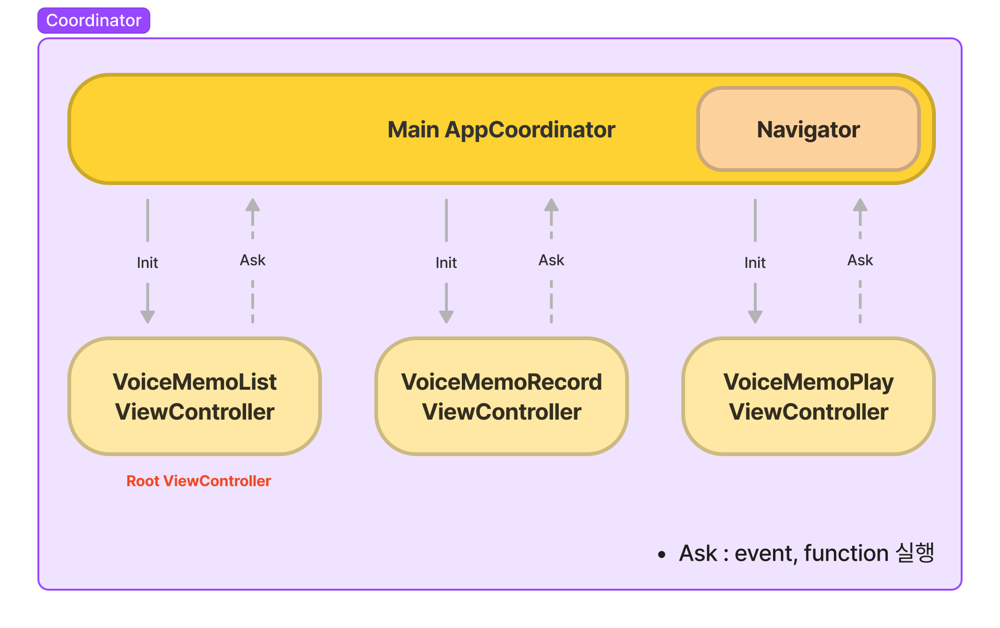

# 목차
  1. [Team](#Team)
     1. [팀원 소개](#팀원-소개)
     2. [기여한 부분](#기여한-부분)
  2. [프로젝트 소개](#프로젝트-소개)
     1. [목표](#목표)
     2. [사용한 기술](#사용한-기술)
     3. [기능 소개](#기능-소개)
        - [App Flow](#App-Flow)
        - [Demo gif](#Demo-gif)
     4. [사용한 Pattern 소개](#사용한-Pattern-소개)
        - [Coordinator Pattern](#Coordinator-Pattern)
        - [Observer Pattern](#Observer-Pattern)
     5. [객체 역할 소개](#객체-역할-소개)
        - [View 관련](#View-관련)
        - [Manger 관련](#Manger-관련)
     6. [Project UML](#Project-UML)
  3. [고민한 부분](#고민한-부분)
  4. [회고](회고)
  
---

# Team
## 팀원 소개 

| Downey                       | JMin                             |                            Oyat|
| ---------------------------- | -------------------------------- |----------------------------|
| | ||
|개발 및 팀 리딩, 기술 소개 | 개발 및 앱 Bug 탐색 | 개발 및 스터디 내용 자료 제작 |

## 기여한 부분

| 팀원 | 기여한 내용|
| ---------------------------- | -------------------------------- |
| Downey| 내용|
| JMin| 내용|
| Oyat| 내용|

# 프로젝트 소개
## 목표
> 요구사항에 적합한 녹음 앱 개발
> 외부 라이브러리 : __FirebaseStorage Only!__
## 사용한 기술
`Coordinator Pattern` `Observer Pattern` `Delegate Pattern`
`Code-based UI` `MVC` `Dependency inversion`
  
## 기능 소개

### App Flow
  - all Flow
  

  
  

  - ListView Flow
  

  
  

  - RecordView Flow
  

    
  

  - PlayView Flow
    

  

  
### Demo Gif
  - 첫 화면
  
   

  

  - RecordView, 레코드 기능
  
   

  

  - RecordView, 재생 기능
  
   

  

  - PlayView, 재생기능
  
   

  

## 사용한 Pattern 소개
### Coordinator Pattern

  
  

### 1. 코디네이터 패턴을 사용한 이유
> MVC에 Coordinator패턴을 적용함으로 Massive VC를 덜어내기 위해 사용하였습니다.

### 2. 어떤 장점이 존재할까?
> Coordinator가 화면 전환 역할을 해주는 객체가 되어 좀 더 VC를 가볍게 만들 수 있습니다. 화면 전환에 대한 코드가 모여 있어 파악, 관리하기가 용이하고 게다가 책임과 구분(역할)에 따라 여러 개의 Coordinator를 사용할 수 있어 객체지향적으로 구현하기 더 수훨합니다.

### Observer Pattern

  
  

### 1. 옵저버 패턴을 사용한 이유
> 옵저버 패턴을 활용하면 변경사항이 생겨도 무난히 처리할 수 있는 유연한 객체 지향 시스템을 구축할 수 있기 때문입니다. 이는 객체 사이의 상호 의존성을 최소화할 수 있기 때문입니다.(느슨하게 결합되어 있기 때문)

### 2. 어떤 장점이 존재할까?
> - Delegate Design Pattern 은 1:1 관계에서 사용하는 반면, Observer & Notification Pattern 은 1:다 관계 성립 가능
( ex. 저희의 경우 레코드뷰, 플레이뷰 2곳에 옵저버를 생성해 AudioPlayable 객체에 1개의 Notification 을 기다릴 수 있게 하였습니다)
> - 실시간으로 한 객체의 변경사항을 다른 객체에 전파할 수 있습니다.
> - 느슨한 결합(Loose Coupling)으로 시스템이 유연하고 객체간의 의존성을 제거할 수 있습니다
> - Open / Close 원칙(개방 폐쇄 원칙)을 지킬 수 있습니다. (개방 폐쇄 원칙: 확장에는 열려있고, 변경에는 닫혀있어야 한다.)

### Delegate Pattern

  
  

### 1. 딜리게이트 패턴을 사용한 이유
> - Delegate을 사용하여 설계하지 않고 Notification만 가지고 설계를 한다면 다른 사람이 코드를 유지보수할 때 이 Notification을 누가 Subscribe하고 있는지 알기가 어렵기 때문에 1:1 관계라면 Delegate을 사용하여 해당 Delegate의 이름, 프로토콜의 메서드 등을 통해 어떤 과정에 의해 이벤트 처리 로직이 돌아가는지 파악하고 추적하기가 한결 수월하기에 Delegate 패턴을 사용하는 것이 좋다고 생각했습니다.

### 2. 어떤 장점이 존재할까?
> - 매우 엄격한 Syntax로 인해 프로토콜에 필요한 메소드들이 명확하게 명시됨.
> - 컴파일 시 경고나 에러가 떠서 프로토콜의 구현되지 않은 메소드를 알려줌.
> - 로직의 흐름을 따라가기 쉬움.
> - 프로토콜 메소드로 알려주는 것뿐만이 아니라 정보를 받을 수 있음.
> - 커뮤니케이션 과정을 유지하고 모니터링하는 제 3의 객체(ex: NotificationCenter 같은 외부 객체)가 필요없음.
> - 프로토콜이 컨트롤러의 범위 안에서 정의됨.

## 객체 역할 소개

### View 관련

| class / struct               | 역할                                                         |
| ---------------------------- | ------------------------------------------------------------ |
| `SceneDelegate`         | - 앱의 초기 권한 요청, Coordinator 및 비즈니스 로직 객체를 생성함.  |
| `AppCoordinator`      | - 앱의 화면 전환을 담당하는 객체. SceneDelegate로 부터 전달받은 객체를 각 ViewController의 필요에 맞게 전달한다.   |
| `VoiceMemoListView`           | - FirebaseStorageManager를 이용하여 사용자의 녹음 파일 목록을 가져온다. - 파일명에 따른 metaData를 얻어와 View에 표기한다.  - 셀을 슬라이드하여, 로컬과 FirebaseStorage내의 녹음 파일을 삭제 할 수 있다. |
| `VoiceMemoRecordView`             | - 녹음을 할 수 있다. - 녹음 시 특정 주파수 이하만 통과 할 수 있도록 한다. - 녹음 시 볼륨 파형을 볼 수 있다.  - 녹음을 재생 할 수 있으며, 재생 위치를 5초 전후로 이동 할 수 있다. - 녹음 완료 시, 녹음 파일을 FirebaseStorage에 업로드한다. |
| `VoiceMemoPlayView` | - 녹음을 재생 할 수 있으며, 재생 위치를 5초 전후로 이동 할 수 있다. - 녹음의 pitch를 바꿔 목소리를 변조 할 수 있다.  - 재생 위치를 View의 색 변화를 통해 알 수 있다.  - 녹음 파일의 볼륨 파형을 볼 수 있다. - 슬라이더를 사용하여 볼륨을 조절 할 수 있다. |
| `WaveFormView`       | - 전달받은 볼륨 파형 Data를 사용하여 User가 볼륨 파형을 쉽게 알 수 있도록 한다. |

### Manger 관련

| class / struct               | 역할                                                         |
| ---------------------------- | ------------------------------------------------------------ |
| `FirebaseStorageManager`         | - FirebaseStorage와 Networking 하는 객체. - 파일 목록 가져오기, 파일의 metaData가져오기, 파일의 다운, 업로드, 삭제 기능    |
| `PathFinder`      | - Class FileManager를 감싼 객체. - 앱에서 필요한 Local File System에 접근하는 기능을 제공.  - 현재 시간을 파일 경로로 제공하는 기능 제공  |
| `AudioManager`           | - Protocol AudioRecordable과 AudioPlayable 채택시, 상속해야 하는 Class.  -두 Procotol의 구현 class에 필요한 공통 Property, Method를 제공한다.  |
| `AudioRecodable`             | - 녹음 기능을 제공하는 Recorder의 기능을 명시하는 Protocol |
| `DefalutAudioRecoder`             | - AudioRecodable을 채택한 Recoder기능을 View에 제공하는 Class |
| `AudioPlayable`             | - 녹음 파일을 재생하는 Player의 기능을 명시하는 Protocol  |
| `DefalutAudioPlayer` | - AudioPlayable을 채택한 Player기능을 View에 제공하는 Class |

## Project UML

# 고민한 부분

## Downey
## Oyat
## JMin
### 1. 플레이 및 레코딩에 사용할 객체 고민
- 문제점
  - AVAudioPlayer 및 AVAudioRecorder를 사용할려 했으나 pitch 기능이나 cutoffFrequency기능이 해당 객체에서는 불가능했다
- 해결법
  - **AVAudioEngine** 을 사용하여 구현했다
### 2. Record시 주파수 차단
- 문제점
  - cutoff frequency의 작동방식을 잘못이해하고 있었다 
- 고민했던점 
  - 나이퀴스트 이론에 따르면 sampleRate는 신호의 두배가 되어야 한다는걸 알고 sampleRate를 조절하면 주파수 차단을 할 수 있겠다고 생각했다
  - 에일리싱 현상에 의해 나이퀴스트 주파수보다 신호는 녹음이 안되는게 아닌 왜곡이 돼서 녹음이 된다  
- 해결법
  - 에일리어싱 현상을 해결할려면 **Low Pass Filter**를 적용시켜줘야한다
  - **AVAudioUnitEQ**를 audioEngine에 연결해준다음 Low Pass Filter를 적용시켜줘서 해결했다
- [참고링크](https://m.blog.naver.com/bernardo92/221354727645)
### 3. 특정 기기에서 녹음시 앱이 죽는 현상
- 문제점
  - 기기의 마이크 SampleRate랑 audioEngine의 SampleRate랑 맞지 않아 앱이 죽는 현상이 있다
- 고민했던점
  - 해당 기기의 SampleRate를 audioEngine의 SampleRate로 맞춰주면 해결될거라 생각했다
- 해결법
  - audioEngine의 outFormat의 format가 녹음하는 기기의 format이라는것을 알고 해당 포맷의 SampleRate로 audioEngine의 SampleRate를 설정해서 해결했다
### 4. 녹음파일 재생시 파일의 총 재생시간이 끝나지도 않았는데 재생이 중지되는 문제
- 문제점
  - 녹음파일의 SampleRate랑 audioEngine의 SampleRate랑 맞지않아 발생하는 문제였다
- 고민했던점
  - 현재 재생 구간을 녹음파일의 전체 SampleRate랑 현재 플레이된 타임까지의 SampleRate를 비교하는데 기준이 되는 SampleRate가 달라서 생기는 문제였다
- 해결법
  - **AVAudioPlayerNode**의 SampleRate로 audioEngine SampleRate로 설정해서 해결했다
### 5. 녹음후 재생시 녹음이 이어서 되는 문제
- 문제점
  - 녹음시 연결했던 노드들이 플레이시에도 그대로 남아있어 플레이와 동시에 녹음이 진행되어 발생하는 문제였다
- 해결법
  - 녹음 및 플레이를 정지했을때 audioEngine의 노드들을 순환하며 탭에서 연결을 끊어줘서 해결했다  

# 회고

## Downey
## Oyat
## JMin
### 전체 회고
처음으로 진행한 팀 프로젝트이니만큼 많은게 서툴고 어려웠다
하지만 프로젝트를 진행하면 진행할수록 팀단위로 일하는게 익숙해졌다
보통 개발은 팀 단위로 진행되기때문에 협업을 하여 개발해본 경험은 앞으로 큰 도움이 될거라 생각한다  
 
### git 관련 회고
지금까지는 혼자서 개발을 해왔기때문에 fork, pr의 개념을 몰랐다
또한 깃을 단순히 github에 저장하기만을 위헤 사용해왔어서 branch, merge등의 개념도 모호했다
 
이번 프로젝트를 진행하면서 위 개념들을 숙지하였고 터미널을 사용해서 git을 사용하는데 꽤 익숙해졌다
해당 경험은 앞으로도 git을 통해 버전관리를 하는데 큰 도움이 될거라 생각한다  
 
### 기술관련 회고
- 리팩토링
나는 지금까지 리팩토링을 진지하게 해본적이 없기때문에 사실상 이번 프로젝트에서 내가 리팩토링을 구현한 부분은 거의 없고 진행과정 및 결과를 보기만 했다
리팩토링 전이랑 후랑 비교해봤을때 메서드및 객체의 역할이 분리되고 가독성이 좋안진것을 보고 리팩토링에 관해서는 한번 진지하게 생각해봐야겠다고 느꼈다
- 의존성 주입
의존성 주입을 이번에 처음 들어봤다
의존성 주입은 SOLID방식중 D에 해당하는 방식이며 이 방법을 채택할경우 테스트 및 유지보수, 기능의 추가 / 변경이 용이해진다는 장점이 있다
실제로 의존성 주입방식으로 돼있는 코드를 리팩토링하는 과정을 봤는데 객체가 직접 인스턴스를 잡고있는 방식보다 훨씬 쉽게 리팩토링되는것을 보고 놀랐다  
아직 의존성 주입에 관해서 정확한 개념을 알진 못한다
이는 하루아침에 께딛는것이라 생각하지 않으며 앞으로 SOLID원칙과 함께 꾸준히 공부할 계획이다  
 
### 협업 관련 회고  
지금까지는 혼자서 프로젝트를 진행했기때문에 컨벤션에 대해서 신경을 안써왔다
하지만 협업시에는 내 코드를 나만보는게 아닌 팀 모두가 보기때문에 가독성을 위해 공통된 컨벤션이 필요하다
